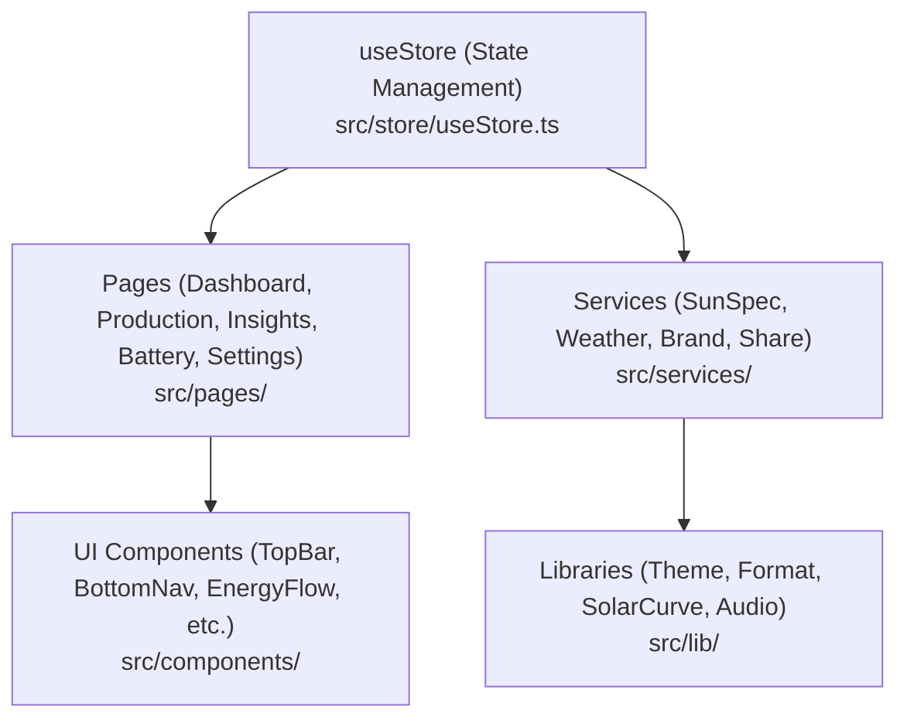

# Architecture & Core

**Summary:** The Helios PWA is built on Vite, React, and TypeScript, utilizing Zustand for global client-side state management and VitePWA for offline-first capabilities.

## How it works

## Key files

| File | Role |
| :--- | :--- |
| `vite.config.ts` | Configures Vite build settings, React plugin, and PWA manifest with Workbox caching strategies. |
| `tsconfig.json` | TypeScript compiler options and strict type checking rules. |
| `src/store/useStore.ts` | Central Zustand store holding application state, page routing, telemetry, connection settings, weather/forecast data, themes, and branding. |
| `src/types/index.ts` | Defines core TypeScript interfaces and types for telemetry, inverter status, insights, forecast, and brand configuration. |

## Gotchas

None found in the supplied evidence.

## Sources

- [vite.config.ts](infy://wiki/40d98eee-a3a7-4272-ba0a-285793586ec1/pages/a58a1335-f681-4123-bf0a-05ae9e4100df) · SHA-256 91044400ff35a248537b1e7e3552791b0ca5cb2f1f26919e54a2a2359aedc4e1
- [tsconfig.json](infy://wiki/40d98eee-a3a7-4272-ba0a-285793586ec1/pages/5cb222dc-0125-486b-a26c-aae2ac8d1ffc) · SHA-256 6d4133e6e4a2e43041fc6633dcd7eb73d39726bea8876d8e845ad208d28d9bf7
- [src/store/useStore.ts](infy://wiki/40d98eee-a3a7-4272-ba0a-285793586ec1/pages/5136dab5-5b0e-4a97-b330-354be7931216) · SHA-256 28f14e31fc7948b8f8db2dca9d3f9ca8011389765440282cff9bbe26a2ba66df
- [src/types/index.ts](infy://wiki/40d98eee-a3a7-4272-ba0a-285793586ec1/pages/92eb1a89-5875-4c66-9293-b006595e1e93) · SHA-256 ebbbf63fd3ed2365bfbcddd7b24900b6da42645bfe8d48f5d9efb5a4aca319e0