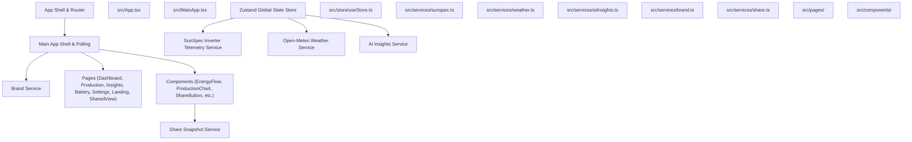

# Overview

**Summary:** Helios is a PWA-first solar intelligence platform that turns raw SunSpec Modbus inverter telemetry and Open-Meteo forecasts into live energy-flow visualization, AI insights, and multi-day battery strategy.

## How it works

## Key files

| File | Role |
|---|---|
| `src/App.tsx` | Root router configuration defining `/`, `/app`, and `/share/:payload` routes. |
| `src/MainApp.tsx` | Main PWA app shell, polling ticker, theme/brand application, and desktop frame layout. |
| `src/store/useStore.ts` | Zustand global state store managing telemetry, active page, connection settings, and weather forecasts. |
| `src/services/sunspec.ts` | SunSpec Modbus TCP telemetry service and mock solar array telemetry simulation. |
| `src/services/weather.ts` | Open-Meteo weather integration for 7-day production forecasting and geolocation. |
| `src/services/aiInsights.ts` | AI insights generation for solar recommendations and alerts. |
| `src/services/brand.ts` | White-labeling engine supporting brand themes (`helios`, `voltcraft`, `sunworks`, `meridian`). |
| `src/services/share.ts` | Client-side base64url encoding and decoding for shareable deep-link snapshots. |
| `vite.config.ts` | Vite build configuration including `vite-plugin-pwa` manifest and font caching. |
| `tailwind.config.ts` | Tailwind CSS configuration establishing carbon and bone color palettes. |

## Gotchas

- Raw TCP communication with physical inverters requires a local-network gateway or WebSocket relay because browsers cannot speak raw TCP.
- Native mobile applications in `ios/` and `android/` are currently deferred while the PWA is prioritized.

## Project Structure & Deployment

- **Project Structure:** Code is organized around `src/` containing React components, pages, services, state management, types, and styling. Static assets reside in `public/`.
- **Deployment:** The build output (`dist/`) is a fully static site that can be hosted on zero-config static hosts such as Vercel, Netlify, or Cloudflare Pages, provided the SPA fallback is configured to serve `index.html`.

## Sources

- [README.md](infy://wiki/40d98eee-a3a7-4272-ba0a-285793586ec1/pages/2032f430-d157-44aa-9925-8d6521a117b5) · SHA-256 c9fb5dc1f8184d9ec23434faa2f300d69fb66584cfbba5e9eb0b0e73e7513731
- [package.json](infy://wiki/40d98eee-a3a7-4272-ba0a-285793586ec1/pages/5f9fe69a-b287-4960-931b-074828a4bbe0) · SHA-256 48e8d4f247cfc63c5825832bc3cc88ce811df79847b12769794561ca3e6b139b
- [src/App.tsx](infy://wiki/40d98eee-a3a7-4272-ba0a-285793586ec1/pages/47921b3c-897d-41aa-9d34-87b4b5b43822) · SHA-256 54b69f8929479347ee7047887f2c417b679ddc2e2d530d4bed3d6f026e610665
- [src/MainApp.tsx](infy://wiki/40d98eee-a3a7-4272-ba0a-285793586ec1/pages/42636cd9-7124-47bd-ab6e-83a110403998) · SHA-256 b060224534764d40bcb648c6623ed8d2ed591b15164424e3c5f2a3f6e40d13ed